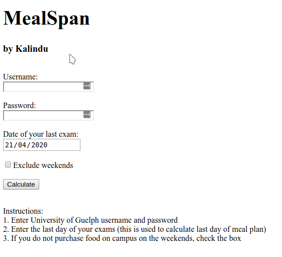

# MealSpanWeb

Web version of MealSpan application. A webapp to help University of Guelph students to budget their spending throughout the span of their meal plan.

1. $ export FLASK_APP=webapp.py
2. $ flask run

Website can be found at https://mealspan.herokuapp.com

